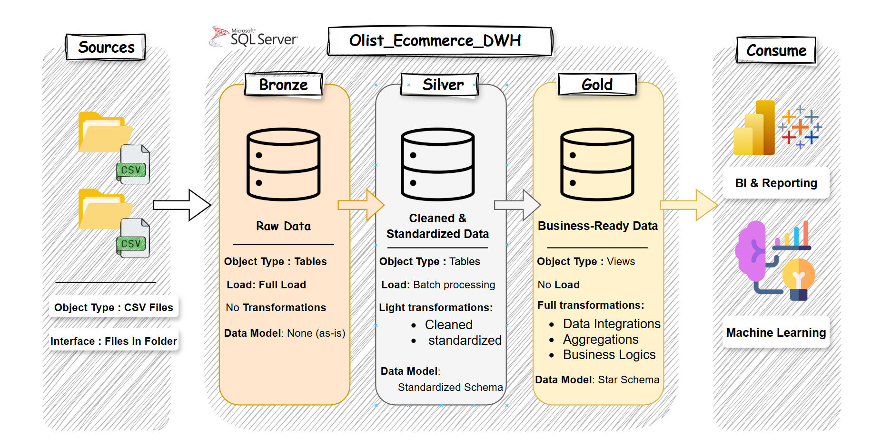

# Datawarehouse_Project
Welcome to the **Data Warehouse and Analytics Project** repository! 🚀

## 🏗️ Data Architecture

The data architecture for this project follows Medallion Architecture **Bronze**, **Silver**, and **Gold** layers:

1. **Bronze Layer**: Stores raw data as-is from the source systems. Data is ingested from CSV Files into SQL Server Database.
2. **Silver Layer**: This layer includes data cleansing, standardization, and normalization processes to prepare data for analysis.
3. **Gold Layer**: Houses business-ready data modeled into a star schema required for reporting and analytics.

---
## 📖 Project Overview

This repository presents a **complete Data Warehouse and Analytics Project**, showcasing a full-scale implementation of modern data engineering practices. The project includes:

1. **Data Architecture**: Designing a robust **Medallion Architecture** with **Bronze**, **Silver**, and **Gold** layers.
2. **ETL Pipelines**: Efficiently extracting, transforming, and loading data from multiple source systems into the warehouse.
3. **Data Modeling**: Creating optimized **fact** and **dimension** tables for high-performance analytical queries.
4. **Analytics & Reporting**: Generating actionable insights through SQL-based reports and dashboards.

🎯 This project is ideal for professionals and students aiming to demonstrate skills in:  
- SQL Development  
- Data Architecture & Engineering  
- ETL Pipeline Development  
- Data Modeling  
- Data Analytics  
---

## 🛠️ Important Links & Tools:

Everything is for Free!
- **[Datasets](datasets/):** Access to the project dataset (csv files).
- **[SQL Server Express](https://www.microsoft.com/en-us/sql-server/sql-server-downloads):** Lightweight server for hosting your SQL database.
- **[SQL Server Management Studio (SSMS)](https://learn.microsoft.com/en-us/sql/ssms/download-sql-server-management-studio-ssms?view=sql-server-ver16):** GUI for managing and interacting with databases.
- **[Git Repository](https://github.com/):** Set up a GitHub account and repository to manage, version, and collaborate on your code efficiently.
- **[DrawIO](https://www.drawio.com/):** Design data architecture, models, flows, and diagrams.
---
## 🌟 About Me
